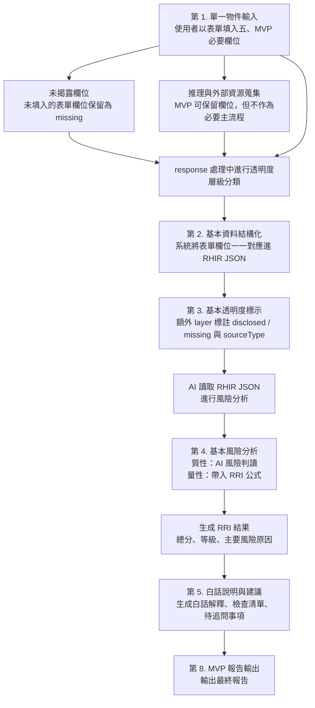

# Rent Unfiltered 透明租屋：MVP 版本規格

更新日期：2026-05-09

## 一、MVP 核心價值

Rent Unfiltered 的 MVP 不是先證明「我們能不能做很多功能」，而是先證明這個專案最核心的價值是否成立：

> 租屋資訊可以被整理成一般人看得懂的風險資訊，幫助第一次租屋者在簽約前更早看見問題。

這個 MVP 要驗證的不是平台流量、媒合效率或自動推薦能力，而是以下三件事：

- 使用者是否真的需要一份比租屋平台更清楚的風險判讀結果
- 分散的租屋資訊是否能被整理成可閱讀、可比較的單一物件摘要
- 風險提醒、揭露狀態與待追問事項，是否能實際幫助使用者做租屋判斷

## 二、MVP 目標

MVP 的目標，是完成一個可實際操作的單一物件風險分析流程。

這個版本先做到：讓第一次租屋者輸入一個物件的基本資訊後，可以得到一份可閱讀的租屋風險報告，知道哪些資訊已揭露、哪些地方有風險、哪些問題需要進一步追問。

## 三、MVP 定位

- 產品類型：租屋資訊透明化與風險判讀工具
- 核心對象：學生、新鮮人、第一次租屋者
- 核心任務：把單一物件的分散資訊整理成可理解的風險資訊
- 核心輸出：一份可閱讀的租屋風險報告
- 核心價值：讓租屋決策不只看價格，而能看見價格背後的風險

## 四、MVP 範圍

### 1. 單一物件輸入

- MVP 只支援表單式輸入，不接受自由撰寫的租屋文案作為主要輸入方式
- 使用者需從系統提供的欄位、選項、枚舉值與是／否題中完成單一物件輸入
- 所有表單欄位都必須能一一對應到 RHIR JSON 的固定欄位
- 表單的目的不是收集敘事文字，而是建立可被結構化、可被比較、可被計分的租屋資料

### 2. 基本資料結構化

- 將輸入資料整理為固定欄位格式
- 以 RHIR 的核心概念記錄欄位值、來源與揭露狀態
- 表單提交後直接生成單一物件的 RHIR JSON 記錄

### 3. 基本透明度標示

- 標示哪些資訊已揭露
- 標示哪些資訊未揭露
- 標示哪些欄位需要使用者進一步確認

### 4. 基本風險分析

- 根據固定規則計算 RRI 風險分數
- 提供風險等級
- 提供主要風險原因

### 5. 白話說明與建議

- 將結果轉成一般使用者可理解的說明
- 產生簽約前檢查清單
- 產生待追問事項

## 五、MVP 必要欄位

### 1. 物件基本資料

- 房型，例如套房、雅房、整層住家、分租套房
- 物件類型，例如公寓、電梯大樓、透天
- 樓層
- 總樓層
- 坪數
- 所在行政區
- 是否可開伙
- 是否可養寵物
- 是否附家具
- 是否附設備

### 2. 房屋與費用

- 租金
- 押金
- 水電費
- 管理費
- 網路費
- 清潔費
- 其他額外費用
- 是否可申請租補
- 是否可報稅

### 3. 契約條件

- 是否有書面契約
- 是否有審閱期
- 修繕責任
- 提前解約條件
- 押金退還方式

### 4. 居住安全

- 是否頂樓加蓋
- 是否違法隔間
- 逃生動線
- 消防設備
- 漏水狀況
- 電線安全
- 門鎖與出入安全

### 5. 租客權益

- 是否禁止報稅
- 是否禁止遷戶籍
- 是否有稅負轉嫁
- 是否存在違法或不合理條款

## 六、MVP RHIR 精華

MVP 不需要實作完整 RHIR 標準，但必須保留 RHIR 最核心的三個概念：

- 每個欄位都要有固定名稱，不可只存在於畫面文字中
- 每個欄位都要記錄值是什麼、來源是什麼、揭露狀態是什麼
- 表單欄位提交後，必須能直接對應到 RHIR JSON

### MVP 採用的 RHIR 最小結構

- `resourceType`
- `property`
- `pricing`
- `contract`
- `safety`
- `rights`
- `transparencyLayer`
- `riskScore`
- `recommendations`

### MVP 欄位對應原則

- 表單中的每一個欄位，都對應到 RHIR 中的一個固定欄位
- 每個重要欄位以 `FieldValue` 概念記錄：
  - `value`
  - `disclosureStatus`
  - `sourceType`
- `disclosureStatus` 至少區分：`disclosed`、`missing`
- `sourceType` 在 MVP 先固定以 `user_input` 為主

### MVP 對應示意

```json
{
  "resourceType": "RentalHousingRecord",
  "property": {
    "propertyType": {
      "value": "套房",
      "disclosureStatus": "disclosed",
      "sourceType": "user_input"
    },
    "floor": {
      "value": 3,
      "disclosureStatus": "disclosed",
      "sourceType": "user_input"
    }
  },
  "pricing": {
    "rent": {
      "value": 12000,
      "disclosureStatus": "disclosed",
      "sourceType": "user_input"
    }
  }
}
```

## 七、MVP 風險分析面向

MVP 僅保留四個最核心的風險面向：

- 契約透明度
- 費用透明度
- 居住安全
- 租客權益

生活適配度不納入 MVP 主分數，避免過早混入個人偏好因素。

## 八、MVP 報告輸出

MVP 報告至少應包含：

- 總風險分數
- 風險等級
- 主要風險原因
- 白話解釋
- 已揭露資訊摘要
- 未揭露資訊摘要
- 簽約前檢查清單
- 待追問事項

待追問事項不只出現在最終報告，也應該在 RHIR 預覽與欄位填寫頁中出現。當平台文字或瀏覽器插件無法確認重要欄位時，系統應將該欄位保留為 `missing`，並產生可執行的追問或現場確認問題。

例如：

- 591 頁面未寫消防設備時，不應推定有或沒有，而應提醒使用者看房時確認滅火器、偵煙器與逃生出口。
- 頁面未寫可報稅或可遷戶籍時，不應自動填否，而應提醒使用者詢問房東並確認契約文字。
- 頁面未寫修繕責任或提前解約條款時，應在待追問事項列出，而不是直接影響為已知風險。

因此 MVP 的風險判讀應區分：

- 已知風險：資料明確揭露且可判讀的風險。
- 未知風險：RRI 關鍵欄位缺漏，需使用者補問或現場確認。
- 待補資料：下次看房、簽約前或與房東溝通時應取得的資訊。

## 九、MVP 系統流程

MVP 的最小流程如下：

1. 使用者輸入單一物件資訊。
2. 系統驗證每個欄位是否符合表單選項與資料型別。
3. 系統將表單欄位一一轉換成 RHIR JSON。
4. 系統標示揭露狀態與缺漏欄位。
5. 系統依規則計算風險分數。
6. 系統生成白話風險報告。

### MVP 流程圖



## 十、MVP 不包含項目

- 不提供租屋刊登功能
- 不做房東房客媒合
- 不做評價平台
- 不串接 LINE 預約看房
- 不做完整多 Agent 架構
- 不接受自由文字或租約 PDF 自動解析作為主要輸入方式
- 不做地區租金行情比較作為必要功能
- 不做公開資料大規模整合作為必要條件
- 不以主觀評論作為核心資料來源

## 十一、MVP 完成標準

若 MVP 已完成，應至少能展示以下能力：

- 對單一物件完成一次輸入到報告的完整流程
- 對單一物件完成一次表單到 RHIR JSON 的完整轉換
- 對使用者清楚呈現風險分數與風險原因
- 區分已揭露資訊與未揭露資訊
- 讓使用者知道下一步應追問什麼、確認什麼
- 讓使用者感受到這份報告比原始租屋資訊更容易理解與更有判斷價值

## 十二、MVP 與最終版本的差異

MVP 先驗證的是「單一物件能不能被看懂」。

最終版本才進一步處理：

- 更完整的 RHIR 標準化
- 更完整的 Transparency Layer
- 租約分析 Agent
- 地區行情 Agent
- 更完整的報告輸出
- 公開資料整合
- 更高程度的自動化與可比較性

## 十三、需與組員討論後確認的內容

以下內容不影響 MVP 的核心方向，但會影響實作方式、展示重點與評分邏輯，應由你與組員共同確認。

### 1. RRI 的初版計分規則

- 四大面向的權重如何分配
- 哪些條件屬於高風險、哪些屬於提醒項
- 風險分數與風險等級的切分方式是否需要調整

### 2. MVP 表單欄位最終定稿

- 哪些欄位列為必填
- 哪些欄位列為選填
- 各欄位的選項值與枚舉值如何標準化

### 3. MVP 報告呈現深度

- 報告是以簡潔版為主，還是包含較完整的欄位說明
- 是否顯示分面向分數
- 是否顯示每個風險結果背後的欄位依據

### 4. AI 在 MVP 中的參與程度

- AI 是只負責白話改寫，還是也參與風險條件判讀
- 哪些內容可由規則產生，哪些內容交給 AI 生成
- Demo 時是否要把 AI 作為必要元件

### 5. Demo 使用場景與測試樣本

- 是否以政大周邊租屋作為主要展示案例
- 要準備幾筆樣本物件
- 樣本資料由誰整理、是否使用真實租屋資訊改寫
