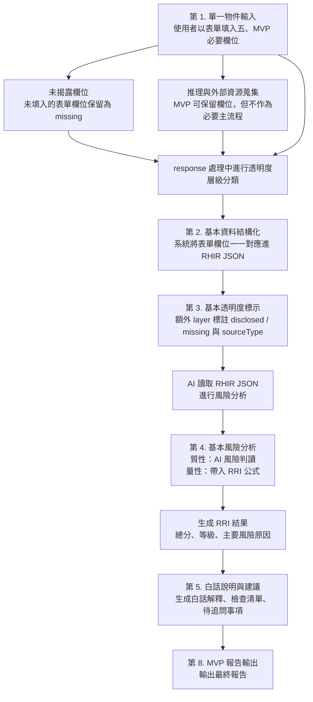

# Rent Unfiltered 透明租屋：MVP 版本規格

更新日期：2026-05-09

## 一、MVP 核心價值

Rent Unfiltered 的 MVP 不是先證明「我們能不能做很多功能」，而是先證明這個專案最核心的價值是否成立：

> 租屋資訊可以被整理成一般人看得懂的風險資訊，幫助第一次租屋者在簽約前更早看見問題。

這個 MVP 要驗證的不是平台流量、媒合效率或自動推薦能力，而是以下三件事：

- 使用者是否真的需要一份比租屋平台更清楚的風險判讀結果
- 分散的租屋資訊是否能被整理成可閱讀、可比較的單一物件摘要
- 風險提醒、揭露狀態與待追問事項，是否能實際幫助使用者做租屋判斷

## 二、MVP 目標

MVP 的目標，是完成一個可實際操作的單一物件風險分析流程。

這個版本先做到：讓第一次租屋者輸入一個物件的基本資訊後，可以得到一份可閱讀的租屋風險報告，知道哪些資訊已揭露、哪些地方有風險、哪些問題需要進一步追問。

## 三、MVP 定位

- 產品類型：租屋資訊透明化與風險判讀工具
- 核心對象：學生、新鮮人、第一次租屋者
- 核心任務：把單一物件的分散資訊整理成可理解的風險資訊
- 核心輸出：一份可閱讀的租屋風險報告
- 核心價值：讓租屋決策不只看價格，而能看見價格背後的風險

## 四、MVP 範圍

### 1. 單一物件輸入

- MVP 只支援表單式輸入，不接受自由撰寫的租屋文案作為主要輸入方式
- 使用者需從系統提供的欄位、選項、枚舉值與是／否題中完成單一物件輸入
- 所有表單欄位都必須能一一對應到 RHIR JSON 的固定欄位
- 表單的目的不是收集敘事文字，而是建立可被結構化、可被比較、可被計分的租屋資料

### 2. 基本資料結構化

- 將輸入資料整理為固定欄位格式
- 以 RHIR 的核心概念記錄欄位值、來源與揭露狀態
- 表單提交後直接生成單一物件的 RHIR JSON 記錄

### 3. 基本透明度標示

- 標示哪些資訊已揭露
- 標示哪些資訊未揭露
- 標示哪些欄位需要使用者進一步確認

### 4. 基本風險分析

- 根據固定規則計算 RRI 風險分數
- 提供風險等級
- 提供主要風險原因

### 5. 白話說明與建議

- 將結果轉成一般使用者可理解的說明
- 產生簽約前檢查清單
- 產生待追問事項

## 五、MVP 必要欄位

### 1. 物件基本資料

- 房型，例如套房、雅房、整層住家、分租套房
- 物件類型，例如公寓、電梯大樓、透天
- 樓層
- 總樓層
- 坪數
- 所在行政區
- 是否可開伙
- 是否可養寵物
- 是否附家具
- 是否附設備

### 2. 房屋與費用

- 租金
- 押金
- 水電費
- 管理費
- 網路費
- 清潔費
- 其他額外費用
- 是否可申請租補
- 是否可報稅

### 3. 契約條件

- 是否有書面契約
- 是否有審閱期
- 修繕責任
- 提前解約條件
- 押金退還方式

### 4. 居住安全

- 是否頂樓加蓋
- 是否違法隔間
- 逃生動線
- 消防設備
- 漏水狀況
- 電線安全
- 門鎖與出入安全

### 5. 租客權益

- 是否禁止報稅
- 是否禁止遷戶籍
- 是否有稅負轉嫁
- 是否存在違法或不合理條款

## 六、MVP RHIR 精華

MVP 不需要實作完整 RHIR 標準，但必須保留 RHIR 最核心的三個概念：

- 每個欄位都要有固定名稱，不可只存在於畫面文字中
- 每個欄位都要記錄值是什麼、來源是什麼、揭露狀態是什麼
- 表單欄位提交後，必須能直接對應到 RHIR JSON

### MVP 採用的 RHIR 最小結構

- `resourceType`
- `property`
- `pricing`
- `contract`
- `safety`
- `rights`
- `transparencyLayer`
- `riskScore`
- `recommendations`

### MVP 欄位對應原則

- 表單中的每一個欄位，都對應到 RHIR 中的一個固定欄位
- 每個重要欄位以 `FieldValue` 概念記錄：
  - `value`
  - `disclosureStatus`
  - `sourceType`
- `disclosureStatus` 至少區分：`disclosed`、`missing`
- `sourceType` 在 MVP 先固定以 `user_input` 為主

### MVP 對應示意

```json
{
  "resourceType": "RentalHousingRecord",
  "property": {
    "propertyType": {
      "value": "套房",
      "disclosureStatus": "disclosed",
      "sourceType": "user_input"
    },
    "floor": {
      "value": 3,
      "disclosureStatus": "disclosed",
      "sourceType": "user_input"
    }
  },
  "pricing": {
    "rent": {
      "value": 12000,
      "disclosureStatus": "disclosed",
      "sourceType": "user_input"
    }
  }
}
```

## 七、MVP 風險分析面向

MVP 僅保留四個最核心的風險面向：

- 契約透明度
- 費用透明度
- 居住安全
- 租客權益

生活適配度不納入 MVP 主分數，避免過早混入個人偏好因素。

## 八、MVP 報告輸出

MVP 報告至少應包含：

- 總風險分數
- 風險等級
- 主要風險原因
- 白話解釋
- 已揭露資訊摘要
- 未揭露資訊摘要
- 簽約前檢查清單
- 待追問事項

待追問事項不只出現在最終報告，也應該在 RHIR 預覽與欄位填寫頁中出現。當平台文字或瀏覽器插件無法確認重要欄位時，系統應將該欄位保留為 `missing`，並產生可執行的追問或現場確認問題。

例如：

- 591 頁面未寫消防設備時，不應推定有或沒有，而應提醒使用者看房時確認滅火器、偵煙器與逃生出口。
- 頁面未寫可報稅或可遷戶籍時，不應自動填否，而應提醒使用者詢問房東並確認契約文字。
- 頁面未寫修繕責任或提前解約條款時，應在待追問事項列出，而不是直接影響為已知風險。

因此 MVP 的風險判讀應區分：

- 已知風險：資料明確揭露且可判讀的風險。
- 未知風險：RRI 關鍵欄位缺漏，需使用者補問或現場確認。
- 待補資料：下次看房、簽約前或與房東溝通時應取得的資訊。

## 九、MVP 系統流程

MVP 的最小流程如下：

1. 使用者輸入單一物件資訊。
2. 系統驗證每個欄位是否符合表單選項與資料型別。
3. 系統將表單欄位一一轉換成 RHIR JSON。
4. 系統標示揭露狀態與缺漏欄位。
5. 系統依規則計算風險分數。
6. 系統生成白話風險報告。

### MVP 流程圖



## 十、MVP 不包含項目

- 不提供租屋刊登功能
- 不做房東房客媒合
- 不做評價平台
- 不串接 LINE 預約看房
- 不做完整多 Agent 架構
- 不接受自由文字或租約 PDF 自動解析作為主要輸入方式
- 不做地區租金行情比較作為必要功能
- 不做公開資料大規模整合作為必要條件
- 不以主觀評論作為核心資料來源

## 十一、MVP 完成標準

若 MVP 已完成，應至少能展示以下能力：

- 對單一物件完成一次輸入到報告的完整流程
- 對單一物件完成一次表單到 RHIR JSON 的完整轉換
- 對使用者清楚呈現風險分數與風險原因
- 區分已揭露資訊與未揭露資訊
- 讓使用者知道下一步應追問什麼、確認什麼
- 讓使用者感受到這份報告比原始租屋資訊更容易理解與更有判斷價值

## 十二、MVP 與最終版本的差異

MVP 先驗證的是「單一物件能不能被看懂」。

最終版本才進一步處理：

- 更完整的 RHIR 標準化
- 更完整的 Transparency Layer
- 租約分析 Agent
- 地區行情 Agent
- 更完整的報告輸出
- 公開資料整合
- 更高程度的自動化與可比較性

## 十三、需與組員討論後確認的內容

以下內容不影響 MVP 的核心方向，但會影響實作方式、展示重點與評分邏輯，應由你與組員共同確認。

### 1. RRI 的初版計分規則

- 四大面向的權重如何分配
- 哪些條件屬於高風險、哪些屬於提醒項
- 風險分數與風險等級的切分方式是否需要調整

### 2. MVP 表單欄位最終定稿

- 哪些欄位列為必填
- 哪些欄位列為選填
- 各欄位的選項值與枚舉值如何標準化

### 3. MVP 報告呈現深度

- 報告是以簡潔版為主，還是包含較完整的欄位說明
- 是否顯示分面向分數
- 是否顯示每個風險結果背後的欄位依據

### 4. AI 在 MVP 中的參與程度

- AI 是只負責白話改寫，還是也參與風險條件判讀
- 哪些內容可由規則產生，哪些內容交給 AI 生成
- Demo 時是否要把 AI 作為必要元件

### 5. Demo 使用場景與測試樣本

- 是否以政大周邊租屋作為主要展示案例
- 要準備幾筆樣本物件
- 樣本資料由誰整理、是否使用真實租屋資訊改寫

## 十四、目前已超出 MVP 的功能盤點

更新日期：2026-05-16

本節根據目前程式、文件與規格整理。這些功能已經超出 MVP 原本「單一物件表單輸入、轉成 RHIR JSON、產生基本 RRI 與白話報告」的最小範圍，可視為決賽版、Demo 強化版或後續產品化版本的功能候選。

### 1. 多頁面產品導覽與知識展示

- 已有首頁、專案導引、名詞解釋、RHIR 規格、資料庫與物件詳細頁等多個頁面，而不只是單一表單與結果頁。
- 名詞解釋與 RHIR 規格頁讓評審或使用者能直接理解 RHIR、RRI 與透明度設計。
- 專案導引頁讓作品不只展示工具，也展示問題意識、資料流程與專案定位。

### 2. RHIR JSON 預覽、複製、下載與欄位檢視

- 表單送出前可預覽 RHIR JSON。
- 詳細頁可依 RHIR 第一層節點查看 JSON 內容。
- 可下載 RHIR `.json` 檔案，讓 RHIR 成為可保存、可交換的資料格式。
- 可複製完整 RHIR JSON，方便測試、文件撰寫或外部分析。
- JSON 顯示具備語法高亮與 `disclosureStatus` 狀態標示，提升可讀性。

### 3. 版本管理與子版本流程

- 每筆租屋紀錄不只是一份單次輸入結果，而是可以有 `X`、`X-1`、`X-2` 等版本歷史。
- 詳細頁可切換不同版本，查看補件前後的完成度、RRI 狀態與說明。
- 可從既有紀錄新增子版本，並以既有 RHIR 欄位預填表單。
- 子版本不是覆蓋原紀錄，而是保存為新的版本節點，支援後續比較與追蹤。

### 4. 本機資料保存與匯入紀錄

- 使用者建立的 RHIR 紀錄會保存到瀏覽器本機儲存空間，不只存在於單次頁面狀態。
- 系統會把使用者新增的紀錄加入首頁列表，形成可返回查看的紀錄庫雛形。
- 已支援匯入 ID 與 URL hash 匯入流程，讓外部擷取資料可以進入表單。

### 5. 瀏覽器外掛擷取流程

- 專案已有 Chrome extension 雛形，可擷取目前頁面的可見文字。
- 外掛會產生匯入 ID，並可導向 Rent Unfiltered 表單載入擷取內容。
- 此功能讓資料來源從純手動表單擴展到 591、租屋平台、社團貼文或其他網頁文字。
- 外掛目前定位是使用者主動擷取，不是批量爬蟲，較符合資料倫理與展示安全。

### 6. 一鍵生成與一鍵補齊測試資料

- 表單提供一鍵隨機生成，可快速建立測試物件。
- 另有多組租約情境範本，可一鍵補齊空白欄位。
- 補齊流程只填入缺漏欄位，避免覆蓋使用者已填內容。
- 這讓 Demo 時能快速展示不同風險型態，不必每次手動輸入完整表單。

### 7. 待詢問欄位與現場確認問題

- 系統不只標示 `missing`，也會依欄位產生具體追問問題。
- 追問問題會標示影響面向，例如契約透明度、費用透明度、居住安全或租客權益。
- RHIR 預覽、欄位填寫情形與報告頁都能看到待詢問項目。
- 這已經從單純風險報告進一步變成看房前溝通清單與補件流程。

### 8. RRI v0.1 規則引擎

- RRI 已具備獨立規則引擎，不只是靜態展示分數。
- 引擎會依 RHIR 欄位即時計算總分、風險等級與分面向分數。
- `missing` 欄位會形成分數區間，區分已知風險與資訊不確定性。
- `conflict` 欄位會以較高風險處理，讓資料矛盾能直接反映在 RRI。
- 目前已納入契約透明度、費用透明度、居住安全、租客權益與生活適配度五個面向。

### 9. 生活適配度作為輔助風險面向

- MVP 原本不把生活適配度納入主分數，但目前 RRI 引擎已保留生活適配度面向。
- 生活適配度包含通勤便利、噪音、採光、垃圾處理、室友條件與寵物限制等項目。
- 此面向較接近個人需求與偏好，適合在決賽版中作為輔助分數或使用者客製化權重基礎。

### 10. Rule-based 結論生成層

- 除了 RRI 分數，系統已有固定格式的結論生成層。
- 結論會整理主要風險、資訊衝突、未揭露欄位與簽約前建議。
- 這一層不消耗 AI 算力，能穩定輸出可重現的白話說明。
- 它讓報告不只顯示數字，也能形成可閱讀的判斷文字。

### 11. AI Insight 風險脈絡解讀

- 報告頁已有 AI Insight 入口，可手動觸發。
- AI Insight 的定位不是重算分數，而是解釋風險組合、欄位關聯與優先追問順序。
- 已設計嚴格提示詞，要求 AI 不自行推測未揭露資訊、不做法律判定、不改變 RRI 分數。
- AI 輸出採結構化 JSON，包含風險摘要、風險模式、優先問題、新手白話與提醒語。

### 12. AI 租屋顧問對話

- 報告頁已有多輪 AI 顧問聊天功能。
- 使用者可針對單一物件詢問「最該擔心什麼」、「如何議價」、「怎麼跟家人解釋」等問題。
- AI 顧問會以 RRI 結構化結果作為回答依據，不重新計分。
- 這讓產品從單向報告延伸為可互動的租屋決策輔助工具。

### 13. API Key 與 AI 設定入口

- 介面已有設定視窗，可保存 OpenRouter API Key 到瀏覽器本機設定。
- 設定視窗會提示不要把真實 key 寫入前端原始碼。
- 這代表專案已開始走向可由使用者設定 AI 服務的模式，而不是單純靜態 Demo。

### 14. RHIR Server 與 Supabase 上傳

- RHIR 預覽視窗已提供上傳到 RHIR 資料庫的功能。
- Supabase 整合可將 RHIR JSON、物件標題、地區與租金寫入 `rhir_uploads`。
- 這讓 RHIR 從本機檔案進一步變成可上傳、可查詢的資料紀錄。
- 此功能已超出 MVP 的本機展示範圍，接近 RHIR Server / API 的早期雛形。

### 15. RHIR 資料庫管理頁

- 系統已有資料庫頁，可讀取所有已上傳的 RHIR 紀錄。
- 管理頁可查看上傳時間、Record ID、物件名稱、地區與租金。
- 可開啟單筆 RHIR JSON 並下載。
- 這讓系統開始具備後台管理與資料稽核能力。

### 16. 設計調整與 Demo 控制面板

- 專案已有 Tweaks Panel，可調整主色、密度與是否顯示 RHIR schema key。
- 這不是一般使用者必要功能，但對 Demo、視覺微調與評審展示很有幫助。
- 可在不改程式的情況下快速切換展示風格。

### 17. 文件與規格體系擴充

- 除 MVP 規格外，已整理 RHIR v0.1 人類可讀規範、JSON Schema、RHIR 整合 MVP 計畫、RRI 與分析報告實踐計畫等文件。
- RRI 文件已細到各欄位分數、AI 判斷提示、輸出格式與總分結構。
- RHIR 文件已開始區分欄位字典、資料來源、揭露狀態與未來 API / Server 發展路線。
- 這些文件讓專案從單一作品展示，擴展成一套資料標準與分析框架。

### 18. 最終版可優先整理成展示亮點的功能

- RHIR：從表單到標準 JSON，再到下載、上傳與資料庫查看。
- RRI：即時計算分數區間，清楚區分已知風險與未知風險。
- 版本管理：同一物件可補件、重建子版本並保留歷史。
- AI Insight：在規則分數之外提供白話脈絡解讀。
- 瀏覽器外掛：從外部租屋頁面擷取文字並匯入分析流程。
- 待詢問清單：把未揭露欄位轉成實際看房或簽約前可問的問題。
