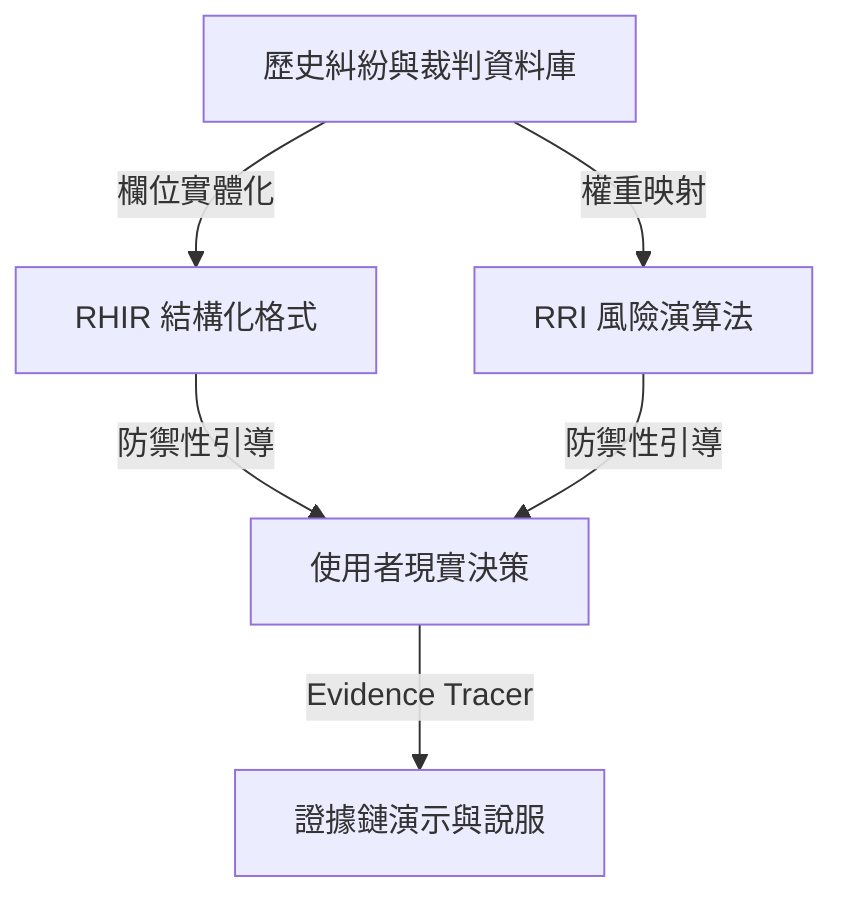

# 租屋無濾鏡 (Rent Unfiltered)：數據驗證與實務應用參考指南

這份指南記錄了本專案「有飢渴需求且已受驗證」的證據演示框架。我們不憑空想像租屋風險，而是將 RHIR 欄位與 RRI 風險演算法建立在真實的政府糾紛、法院裁判、社群聲量與租客訪談之上。

本指南也詳細說明如何取得這些參考資料，以及如何將歷史發生的問題實際應用於解決現實中的租屋痛點。

---

## 一、 四層資料來源框架 (Evidence Source Framework)

為了向評審與使用者證明本系統的實用性與可信度，我們將資料來源分為以下四層結構。每一層都為 `RHIR` 欄位與 `RRI` 風險評分提供不同維度的驗證支持：

### 第一層（★★★★★）：政府真實糾紛案例（最權威的風險對照組）

內政部公開的不動產消費糾紛案例並非單純的冰冷統計，而是包含了**糾紛原因**、**案情說明**、**法令依據**與**最後處理結果**的完整案卷。這些是 RRI 可以直接對應的風險來源。

*   **核心價值**：提供法規與調處實務的直接依據。證明「這個欄位不揭露，在政府調處實務中就是高機率發生糾紛的源頭」。
*   **常見糾紛對照**：
    *   押金返還、電費爭議、漏水、隱瞞重要資訊（如違建、凶宅、結構受損）、契約審閱期、停車位、廣告不實、修繕責任分擔、提前解約賠償、管理費分攤、稅務申報限制、建材設備不符、坪數面積不符。
*   **系統對接**：當 RHIR 中某項條件（如修繕責任）標記為 `未揭露` 時，RRI 風險分析直接關聯到內政部公布的相關糾紛調處案例。

---

### 第二層（★★★★★）：法院裁判書（最無可爭議的實證支持）

建立 **RHIR 裁判案例庫 (RHIR Case Library)**。當每一個 RHIR 欄位的存在都不是出於幻想，而是「因為歷史上真的有人為此打過官司」，這套系統將具備極強的說服力。

*   **核心價值**：展示當糾紛進入司法程序時，法院判決的判定基準。這可以用來回推合約中哪些關鍵字、條款必須被結構化揭露。
*   **實例對接 (RHIR Case Library 概念)**：
    *   **Case-001：漏水修繕與租金減免**
        *   *案情*：租客入住後發現漏水，通知房東後拖延數月不修。
        *   *法院裁判*：依民法第 430 條，租客得定相當期限催告修繕，如房東逾期不修，租客得終止契約或自行修繕請求償還費用，或扣抵租金。
        *   *RHIR 欄位對應*：`RHIR.safety.waterLeak`、`RHIR.contract.repairResponsibility`。
    *   **Case-014：押金扣抵爭議**
        *   *案情*：退租時房東以「房屋折舊、清潔費」為由扣留全部押金。
        *   *法院裁判*：自然折舊不應由租客負擔；若無特別約定，房東不得無故扣留。
        *   *RHIR 欄位對應*：`RHIR.contract.depositRefundTerms`（約定自然折舊免責）。
*   **系統對接**：在 RHIR 詳細頁的風險警示旁，直接附上「裁判案例參考」，點擊可查看法院如何判定此類爭議，提醒租客在簽約前補齊該欄位。

---

### 第三層（★★★★☆）：社群聲量與大眾痛點（最真實的日常需求）

分析 591、Facebook 糾紛社團、Dcard、PTT 租屋板的熱門討論。這些討論雖然不能直接作為法律依據，但能精準反映「當下大家一直卡關的現實問題」。

*   **核心價值**：發現新型態的漏洞或大眾容易忽略的灰色地帶。
*   **常見痛點對照**：
    *   *社群現象*：房東在刊登時寫「電費照表計算」，但簽約時才說「每度固定 6 元」，或「公共電費由所有人平分（但沒有明細）」。
    *   *RHIR 欄位對應*：`RHIR.expense.electricityPricingDetail`（非僅揭露「有表」，而是揭露「計價方式是否符合台電標準」）。
*   **系統對接**：系統在使用者輸入「電費另計」時，會提醒「*社群高風險痛點：電費計價方式尚未具體揭露（如：每度幾元、夏月非夏月算法），歷史統計有 40% 的電費爭議源於此，建議請房東寫明。*」

---

### 第四層（★★★★★）：真實租客訪談與需求分類（最客觀的痛點排序）

如果進行 100 位租客的深度訪談，蒐集他們「人生租屋最痛苦的一件事」，並將其轉化為百分比數據。

*   **核心價值**：作為 RRI (Rental Risk Index) 風險權重計算的實質權重依據。
*   **權重映射範例**：
    *   **35% 押金扣留** $\rightarrow$ RRI 中 `depositRefundTerms` 的權重設為最高（扣分比重 35%）。
    *   **22% 房屋漏水與設備修繕** $\rightarrow$ RRI 中 `repairResponsibility` 與 `waterLeakInspection` 權重設為 22%。
    *   **18% 提前解約限制** $\rightarrow$ RRI 中 `terminationTerms` 權重設為 18%。
    *   **14% 電費超收與轉嫁** $\rightarrow$ RRI 中 `electricityPricing` 權重設為 14%。
    *   **11% 其他**（鄰居噪音、消防安全、遷戶籍申報所得稅限制等）。
*   **系統對接**：向評審與使用者展示：「我們的風險評分演算法不是拍腦袋決定的，而是根據 100 位真實租客的痛點統計比例進行加權。」

---

## 二、 實際解決歷史問題並落地於現實應用的路徑

我們如何把「歷史發生的問題」轉化為「現實中可用的防禦性工具」？有以下三個層次的實作應用：

### 1. 欄位實體化：用歷史糾紛回推 RHIR 欄位
我們不讓使用者大海撈針，而是將歷史上最容易吵架的點，做成表單上的必填或必選揭露項。
*   *歷史問題*：房客退租時，房東說牆壁有髒污、地板有刮痕，要扣 2 萬押金。
*   *現實解決方案 (RHIR)*：強制在 RHIR 設計 `checkInConditionPhotoRecord`（入住屋況拍照存證約定）與 `normalWearAndTearExemption`（自然折舊免責條款）。如果這兩個欄位在合約或現況中是 `未約定`，系統就直接拉高風險評級。

### 2. 演算法實證化：用糾紛統計定義 RRI 扣分權重
*   *歷史問題*：傳統租屋檢核表只會給一個「符合 / 不符合」清單，但無法告訴租客「哪一個問題最致命」。
*   *現實解決方案 (RRI)*：利用崔媽媽基金會與內政部的糾紛統計比例作為權重分配。押金條款不清的扣分權重，應大於公設垃圾分類不清晰的扣分權重。這讓 RRI 的風險分數具有經濟學與統計上的意義。

### 3. 現實引導防禦：從「挑毛病」轉向「輔助溝通」
*   *歷史問題*：很多租客不敢直接跟房東爭取權益，怕被覺得是刁民。
*   *現實解決方案*：當系統判定某項條件為高風險時，不僅給出分數，還提供**「複製詢問話術」**與**「法規依據」**。
    *   *例如*：偵測到電費每度 8 元（高於台電上限）。
    *   *系統提示*：`歷史法律風險：此約定違反住宅租賃契約應約定事項。`
    *   *解決方案*：提供一鍵複製話術：「房東您好，關於合約中電費的部分，為了符合現行內政部住宅租賃規定，我們是否可以修改為依台電帳單按比例分攤，或是調整為不超過台電夏月最高用電度數之金額呢？」

---

## 三、 真實資料參考來源與檢索工具

在開發與驗證過程中，可以參考並抓取以下真實數據來源：

### 1. 政府公開資料與糾紛案例庫
*   **內政部不動產交易服務網 - 房地產消費糾紛案例**
    *   *內容*：提供季度的糾紛案例解析，包含糾紛種類、案情說明、法令依據、處理結果。
    *   *參考連結*：[內政部不動產交易服務網 - 房地產消費糾紛案例](https://lvr.land.moi.gov.tw/) (路徑：首頁 > 關係專區 > 消費糾紛案例)
*   **內政部地政司全球資訊網 - 房地產消費糾紛統計**
    *   *內容*：每季公布全國各縣市糾紛統計表格，可取得押金、漏水、契約審閱期等糾紛的最新排名與數量。
    *   *參考連結*：[內政部地政司 - 不動產交易安全專區](https://www.land.moi.gov.tw/)
*   **住宅租賃契約應約定及不得約定事項**
    *   *內容*：政府規定的定型化契約最低標準，是 RHIR 合規性檢查（如電費上限、押金上限兩個月、不得限制報稅與遷戶籍）的法律底牌。

### 2. 司法裁判檢索
*   **司法院法學資料檢索系統 (裁判書查詢)**
    *   *內容*：可查詢台灣各級法院的所有民事判決書。
    *   *檢索關鍵字建議*：
        *   `租賃 押金 返還 折舊`（檢索退租押金扣抵糾紛）
        *   `租賃 漏水 減少租金 催告`（檢索房屋漏水修繕糾紛）
        *   `租賃 提前終止 違約金`（檢索解約賠償 dispute）
        *   `租賃 電費 超收 違法`（檢索電費計算爭議）
    *   *參考連結*：[司法院裁判書查詢](https://judQueryResult.judicial.gov.tw/)

### 3. 民間倡議團體與專家研究
*   **崔媽媽基金會 (Tsuei Ma Ma Foundation)**
    *   *內容*：台灣最權威的租屋權益倡議團體。每年發布「年度租屋糾紛諮詢統計報告」，這報告就是第四層「租客痛點百分比」的現成權威來源。
    *   *實務資源*：崔媽媽出版的《租屋糾紛調解手冊》、《房東房客法規指南》。
    *   *參考連結*：[崔媽媽基金會官網](https://www.tmm.org.tw/)
*   **OURs 都市改革組織**
    *   *內容*：長期追蹤青年租屋困境、黑市租屋問題，提供豐富的青年租屋問卷調查報告。

---

## 四、 產品演示（Demo）中的「證據鏈」演示設計

為了在決賽或 Demo 中讓評審留下深刻印象，建議在網頁詳細頁面實作一個 **「Evidence Tracer (風險證據追蹤器)」**：

1.  **直觀的風險警告**：
    在 RHIR 詳細頁面，如果某個欄位（例如 `RHIR.contract.repairResponsibility`）是 `未約定` 或 `資訊模糊`，旁邊會顯示紅色的警告標籤。
2.  **一鍵點擊「為什麼這是風險？」**：
    點擊警告後，彈出側邊欄或 Modal，展示該項目的**「歷史證據鏈」**：
    *   **司法裁判案例**：
        > 📄 **臺灣士林地方法院 111 年建簡上字第 X 號**
        > * 糾紛：租客因浴室漏水影響居住，要求房東修繕，房東拖延，租客自行找水電修繕並扣抵租金，被房東提告欠租。
        > * 法院判決：租客催告程序合法，得自租金中扣除修繕費，房東敗訴。
        > * **系統引導**：本房源未約定修繕責任與期限，可能導致您遇到類似訴訟風險。
    *   **崔媽媽統計**：
        > 📊 **崔媽媽基金會統計**：修繕責任爭議佔年度租屋糾紛第 2 名（約 21.4%）。
    *   **社群真實案例**：
        > 💬 **Dcard 租屋板真實發文**：「冷氣壞掉兩個月房東都不修，每天熱到睡不著，傳訊息都已讀不回...」
3.  **防禦性對策工具**：
    在 Evidence 下方直接提供「房東談判話術」與「標準定型化契約條款範本」，讓租客可以直接複製去跟房東確認，完成「發現歷史問題 $\rightarrow$ 現實工具防禦」的閉環。

這套證據演示環節，能將專案從「幫租客看合約的 AI 工具」升級為「基於台灣租屋司法與社群實證的風險防禦系統」，大大增強說服力與產品的渴求度。
